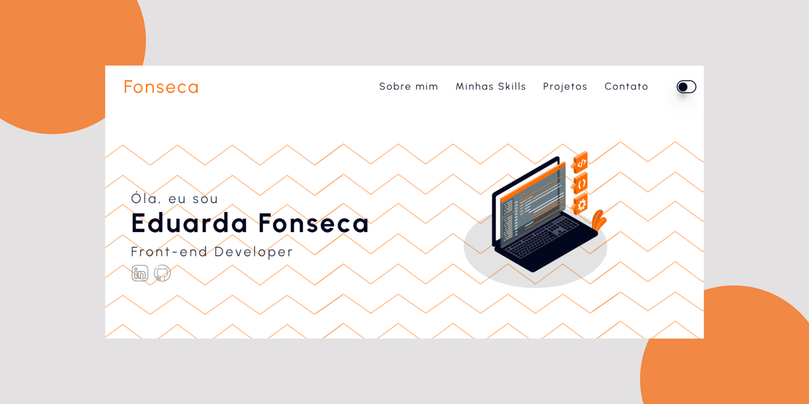
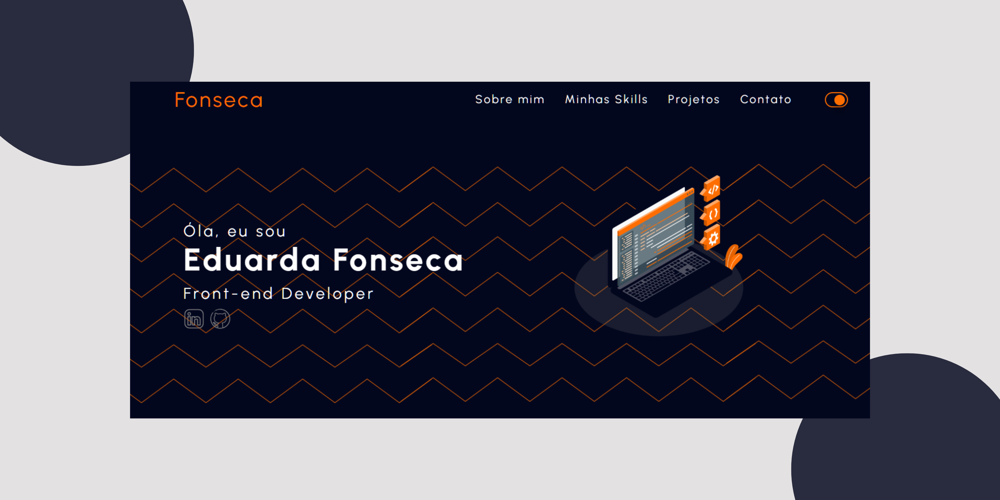

  <h1 align="center">Portifólio 2025</h1>
  

 <h2>Principais Pontos Funcionais</h2>
 

Desenvolvimento de um portfólio pessoal.
Utilização de HTML, CSS e JavaScript para a construção da página web
Adição de imagens e outros elementos visuais para melhorar a aparência do portfólio.

<h2>Tecnologia Utilizada</h2>

 HTML

CSS

JavaScript

  

   
   
  
   
     
    
   

